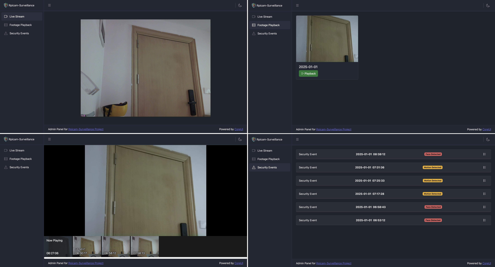
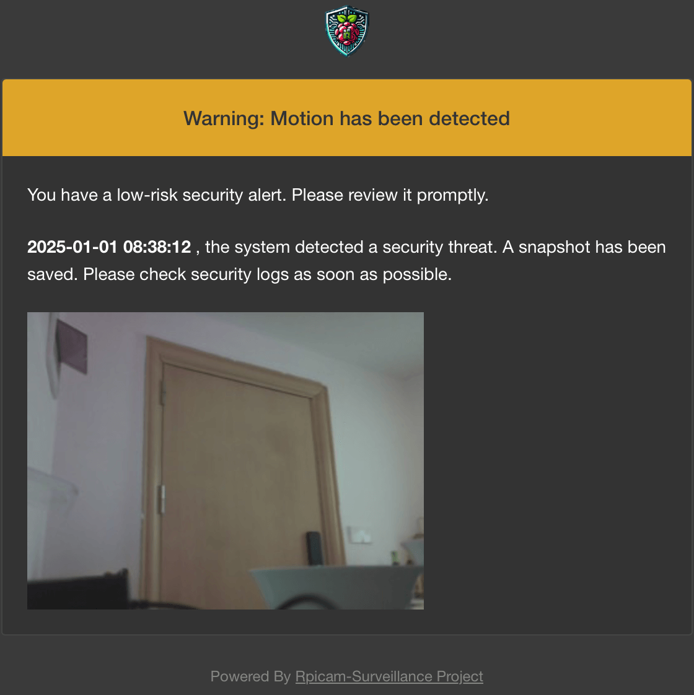

#  Rpicam-Surveillance


A ligthweight surveillance program based on `rpicam-apps`, with a simple web interface and security alerts.

Screenshot of web backend:



Screenshot of email:



## Motivation

[rpicam-apps](https://github.com/raspberrypi/rpicam-apps) is a Raspberry Pi camera program that provides a good start for building advanced camera applications. It also demonstrates the use of TensorFlow Lite (TFLite) for loading models to perform vision tasks. [Ultra-lightweight face detection model](https://github.com/Linzaer/Ultra-Light-Fast-Generic-Face-Detector-1MB) provides a pre-trained TFLite model and achieves real-time face detection performance on embedded devices. Raspberry Pi 3 and 4 come equipped with powerful H.264 hardware encoders, and project like [h264-live-player](https://github.com/131/h264-live-player) make it possible to decode and play raw H.264 real-time video streams directly in a web browser. This project also integrates [mongoose](https://github.com/cesanta/mongoose), a lightweight web server, to provide WebSocket and HTTP access services. It uses [videojs](https://videojs.com) to play recorded videos and `libcurl` to send email alerts. With the conveniences provided by these projects, creating a lightweight home surveillance camera system with web interface becomes significantly easier.

## Installation

To properly enable rpicam-surv application, need to install three components: one is the common dependency of **rpicam-apps**, the other is the dependency for face detection post-processing, which is **tflite** (TensorFlow Lite), and security alert (Email) dependency.

### [rpicam-apps](https://www.raspberrypi.com/documentation/computers/camera_software.html#building-rpicam-apps-without-building-libcamera)

Install essential dependencies:

```bash
sudo apt install -y libcamera-dev libepoxy-dev libjpeg-dev libtiff5-dev libpng-dev
```

```bash
sudo apt install -y cmake libboost-program-options-dev libdrm-dev libexif-dev
```

Install video-related dependencies:

```bash
sudo apt install libavcodec-dev libavdevice-dev libavformat-dev libswresample-dev
```

If you run Raspberry Pi OS Lite, install git:

```bash
sudo apt install -y git
```

### TensorFlow Lite

Download and install the [precompiled package](https://lindevs.com/install-precompiled-tensorflow-lite-on-raspberry-pi/) directly without building:

```bash
wget https://github.com/prepkg/tensorflow-lite-raspberrypi/releases/latest/download/tensorflow-lite_64.deb
```

```bash
sudo apt install -y ./tensorflow-lite_64.deb
```

```bash
rm -rf tensorflow-lite_64.deb
```

### Email Support (Recommend)

Install `libcurl` package:

```bash
sudo apt install -y libcurl4-openssl-dev
```

### Meson build & install

Install the meson build system and ninja build tools:

```bash
sudo apt install -y meson ninja-build
```

Set up the meson configuration, specifying the required feature enable and disable options:

```bash
cd rpicam-apps
```

```bash
meson setup build -Denable_libav=enabled -Denable_drm=enabled -Denable_egl=disabled -Denable_qt=disabled -Denable_opencv=disabled -Denable_tflite=enabled -Denable_hailo=disabled
```

Compile with a single process to avoid crashes:

```bash
meson compile -C build -j 1
```

Install the built files:

```bash
sudo meson install -C build
```

Update the ldconfig cache if is first time to build:

```bash
sudo ldconfig
```

## Usage

You can start surveillance via the command line:

```bash
rpicam-surv -t 0 -r --inline --profile baseline --web-host 0.0.0.0 --web-port 8000 --post-process-file /usr/local/share/rpi-camera-assets/surveillance.json --alert-config-file /usr/local/share/rpi-camera-assets/alert_config.json --autofocus-mode manual
```

**OR**

(Recommand) Install the program to `/opt/rpicam-surv` and set it to automatically start the service on boot:

```bash
sudo ./install_surv_service.sh
```

Access the web backend by visiting `web_host:8000`.

## Tips

- The resolution can be modified in the `env.conf` file, but for optimal display, a **4:3** aspect ratio is recommended.

- Ensure the **prefix** in the meson configure is set to `/usr/local` and **datadir** is set to `share`.

- Configure the `alert_config.json` in `/usr/local/share/rpi-camera-assets` to ensure the email alert works properly.

- Events, surveillance footage, and web server logs are stored in the `HOME` directory, while the program's logs are located in `/opt/rpicam-surv`.

- For more configurable parameters, refer to [`core/surv_options.hpp`](https://github.com/INeedNZT/rpicam-apps/blob/surveillance/core/surv_options.hpp)

